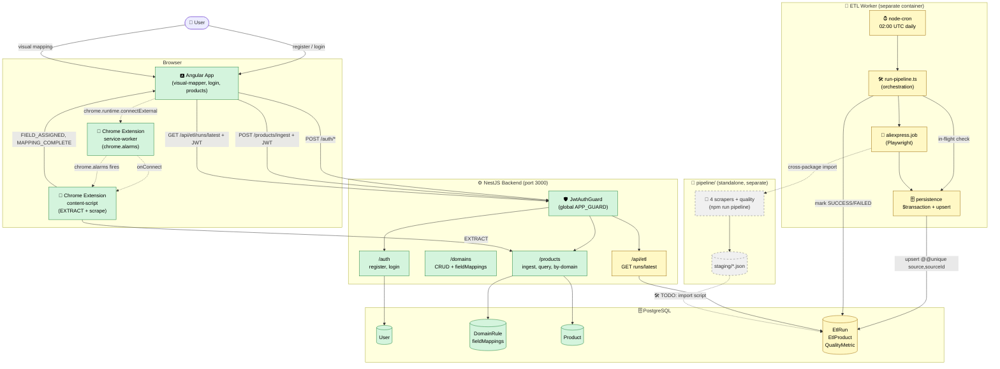

# Flujos actuales del proyecto — 2026-07-07

Estado después de los PRs mergeados/aplicados:
- ✅ **PR #2 merged** (cleanup batch 4-6: JWT auth global, scraping-jobs removal, popup launcher refactor, scraping-jobs migrated, JWT stragegy, etc.)
- ⏳ **PR #3, #4, #6** abiertos (ETL worker integration, stacked-to-develop)
- ✅ **PR #5 merged** (CodeRabbit fixes al cleanup)
- 🔌 **Pipeline legacy** en `/pipeline/` sigue standalone (no conectado al ETL worker — decisión explícita)

Leyenda: `✅ listo` · `⏳ pendiente merge` · `🔌 standalone` · `🛠 planificado`

---

## Vista general



---

## Flujos individuales

### 1. ✅ Visual Mapper (camino principal, post-cleanup merge)

```
👤 User
   ↓ (visual-mapper page)
🅰️ Angular App (frontend)
   ↓ window.postMessage (handshake)
🧩 Chrome Extension content-script
   ↓ FIELD_ASSIGNED, MAPPING_COMPLETE
🅰️ Angular App
   ↓ POST /products/ingest { fieldMappings, products } + Bearer JWT
🛡️ JwtAuthGuard (global)
   ↓ if token valid
⚙️ ProductsController.ingestFromExtension
   ↓ reads DomainRule.fieldMappings
⚙️ ProductsService
   ↓ upsert Product (title, price, sku, dynamic fields)
🗄️ Postgres: Product, DomainRule
   ↓ response
🅰️ Angular shows ingested products
```

**Auth gate**: JwtAuthGuard global, marcado con `@Public()` solo en register/login.

### 2. ✅ Auth (JWT)

```
👤 User
   ↓ POST /auth/register { email, password }
🛡️ JwtAuthGuard (@Public)
   ↓ bcrypt.hash(password, SALT_ROUNDS)
⚙️ AuthService.register
   ↓ try { users.create(...) } catch (P2002)
🗄️ Postgres: User (email unique index)
   ↓ JwtService.sign({ sub: user.id, email })
⚙️ AuthService.issueToken
   ↓ 200 { accessToken, user }
🅰️ Angular stores token, attaches via auth.interceptor (scope: /api/*)
```

CodeRabbit fixes aplicados en este flujo:
- `P2002 → ConflictException` (TOCTOU race recovery)
- `email.trim().toLowerCase()` antes de lookup/storage

### 3. ⏳ ETL Worker (daily cron)

```
⏰ node-cron (02:00 UTC daily, in container env_file)
   ↓
🛠 worker/src/main.ts → runEtlTick('aliexpress')
   ↓ getInFlightRun('aliexpress')
🗄️ Postgres: EtlRun (skip if RUNNING)
   ↓ createRun
🗄️ Postgres: EtlRun (status='RUNNING')
   ↓
📖 worker/src/jobs/aliexpress.job.ts → scrapeBooks()
   ↓ cross-package import
📜 pipeline/scripts/scraping/aliexpress.ts (Playwright, books.toscrape.com)
   ↓ returns ScrapedProduct[]
🛠 worker/src/jobs/run-pipeline.ts
   ↓ $transaction {
🗄️      etlProductRepo.persistProducts(runId, products)
         (upsert on @@unique[source, sourceId] for idempotency)
         etlProductRepo.createQualityMetric(runId, metrics)
   ↓ }
   ↓ completeRun / failRun
🗄️ Postgres: EtlRun (status='SUCCESS'|'FAILED', rowsScraped, rowsPersisted)
   ↓ process.exit(0)
```

**Failure handling**: si Playwright falla, `try/catch` → `failRun(runId, error)` → EtlRun.status='FAILED' con `errorSummary` → `process.exit(0)` (no re-throw, no crash loop).

**Idempotencia**: re-runs el mismo día se saltan vía `getInFlightRun` antes de empezar.

### 4. ⏳ ETL Read API

```
🅰️ Angular / curl / cliente
   ↓ GET /api/etl/runs/latest
   Authorization: Bearer <jwt>
🛡️ JwtAuthGuard
   ↓
⚙️ EtlController
   ↓ etlService.findLatestSuccessful()
🗄️ Prisma: EtlRun.findFirst({ where: { status: 'SUCCESS' }, orderBy: { startedAt: 'desc' }, include: { etlProducts, qualityMetric } })
   ↓
⚙️ EtlRunResponseDto (class-validator decorated)
   ↓ 200 { run, products, quality } | 404 (no runs) | 401 (no JWT)
```

### 5. ✅ Chrome Extension auto-replay (chrome.alarms)

```
🧩 Extension service-worker
   ↓ chrome.alarms fires (per-domain interval, configurable)
📖 Content-script: scrape current tab
   ↓ POST /products/ingest + JWT (auth token from extension.storage)
🛡️ JwtAuthGuard
   ↓
⚙️ Backend (same as visual mapper path)
```

**CodeRabbit fix aplicado**: scheduler chequea `res.ok` antes de marcar `lastRunAt` como success (un 401 del backend ya no se ignora silenciosamente).

### 6. 🔌 Pipeline legacy (standalone, sin conexión al ETL worker)

```
📜 pipeline/scripts/scraping/{mercadolibre,aliexpress,temu,shein}.ts
   ↓ (Playwright, 4 sitios)
📜 pipeline/scripts/quality/quality_checks.ts
   ↓ 7 quality controls
📜 pipeline/scripts/staging/run_all.ts
   ↓ writes JSON
📂 pipeline/staging/{all_products,stg_encuesta,all_products_clean,stg_encuesta_clean,quality_report}.json
   ↓ (NO automatic connection)
🛠 import script (TODO: follow-up PR per design)
```

**Decisión**: el ETL worker (flujo 3) usa SOLO aliexpress → books.toscrape.com para v1 MVP. Los otros 3 scrapers siguen corriendo standalone en `pipeline/` como hasta ahora. Decisión registrada en `sdd/etl-integration-strategy/proposal`.

---

## Tabla resumen

| Flujo | Status | Trigger | Frecuencia |
|---|---|---|---|
| Visual Mapper (extension → backend → DB) | ✅ listo | Usuario abre visual-mapper | Manual |
| Auto-replay (chrome.alarms) | ✅ listo | chrome.alarms | Per-domain interval (configurable) |
| Auth (register/login) | ✅ listo | Usuario | Manual |
| ETL Worker cron | ⏳ pendiente merge (PR #3+#4) | node-cron 02:00 UTC | Daily |
| ETL Read API | ⏳ pendiente merge (PR #4) | HTTP GET | On-demand |
| Pipeline legacy | 🔌 standalone | `npm run pipeline` | Manual |

## Pendientes para v2 (no en scope ahora)

- 🛠 Otros 3 scrapers del pipeline en el worker (mercadolibre, temu, shein)
- 🛠 API rates loader + CSV loader + survey anonymizer
- 🛠 Los 7 quality controls completos (v1 solo tiene completion + uniqueness check)
- 🛠 Angular admin panel con badge estado + botón "Sincronizar Ahora" + métricas + bitácora
- 🛠 Manual trigger desde la UI
- 🛠 Import script del JSON histórico de `pipeline/staging/*.json`
- 🛠 Stronger healthcheck (heartbeat file en lugar de `node -e "console.log('ok')"`)
- 🛠 Persistir `durationMs` en DB o actualizar spec NFR-04
- 🛠 Fix pre-existente: `frontend/theme.service.ts:16` accede a `localStorage` sin mock en test env